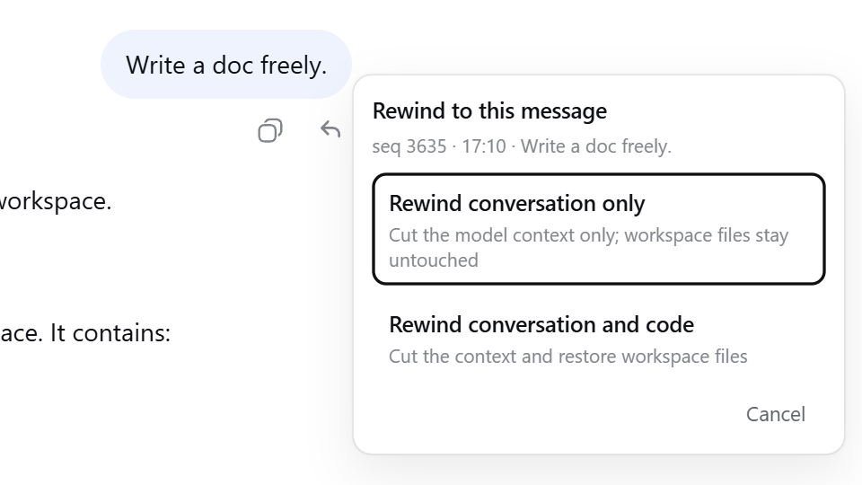
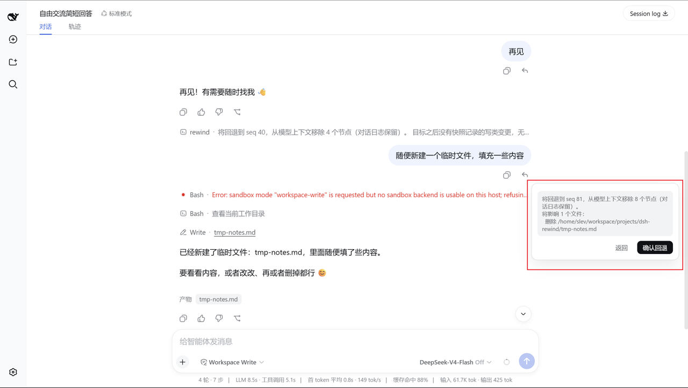
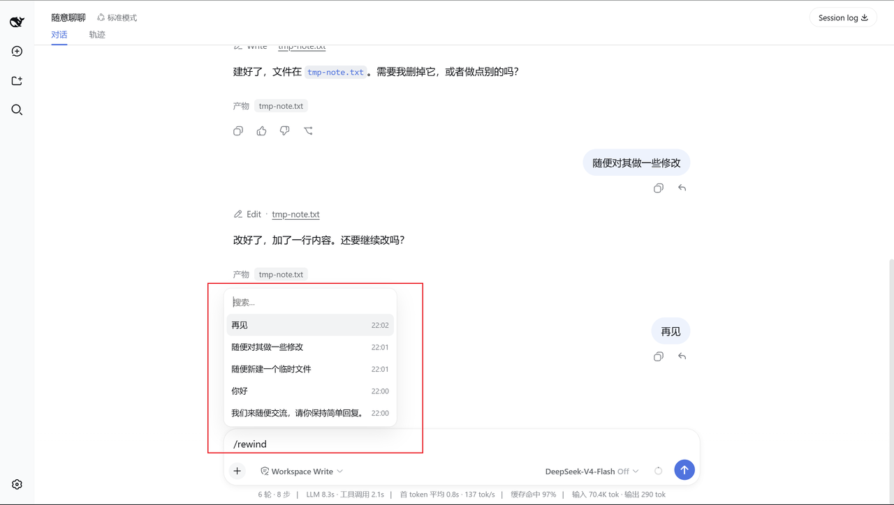

# dsh-rewind

Conversation rewind for DeepSeek Harness: **rewind the conversation to any earlier user message in one click, in the same window** — no new branch, no window switch, with optional workspace-file restore (full Claude Code `/rewind` semantics).

[](https://www.npmjs.com/package/dsh-rewind-plugin)
[](https://github.com/SiriLee/dsh-rewind/blob/main/LICENSE)
[](https://www.npmjs.com/package/dsh-rewind-plugin)

> English | [中文](README.md)

A deliberately focused plugin with one job: **rewind to any user message, no matter how far back, in place** — and conveniently **restore the files it changed** along the way.

- **Rewinding is time-travel** — the target message and everything after it (agent replies, tool calls) are withdrawn from the model context *and* the rendered transcript at once, with no new session and no window switch; the target's text is offered back in the composer so you can edit and re-send it — **truly seamless and convenient by design**.
- **Lightweight workspace backup** — Claude Code-aligned behavior: only file-writing tools are tracked, a lightweight before-backup is **persisted on disk**, and your git repository is never touched or relied on. One lightweight plugin gives you a **complete** agentic rewind capability.
- **Privacy-first** — the plugin never deletes or rewrites the session log (append-only) and never actually deletes any of your conversation; file restores stay inside the plugin's own backup directory. Full security model: [SECURITY.md](SECURITY.md).
- **A complete test system** — unit, probe, and end-to-end host verification, covering compatibility probing, log replay, resume, cross-restart and other scenarios; maintained continuously as the harness evolves to ensure feature stability.

## Preview

Every user message carries a **↶ rewind** button in its action row. Clicking it opens a mode-selection popover — "**rewind conversation only**" or "**rewind conversation and code**", the latter showing the file-change list for confirmation first. You can also rewind conveniently via the **`/rewind` command** or a **keyboard shortcut**.

<table>
  <tr>
    <td align="center"><br><sub>Per-message ↶ rewind button</sub></td>
    <td align="center"><br><sub>Mode-selection popover</sub></td>
  </tr>
  <tr>
    <td align="center"><br><sub>"Conversation and code" impact list</sub></td>
    <td align="center"><br><sub>/rewind candidate picker</sub></td>
  </tr>
</table>

## Install

```sh
dsh plugin --profile web add dsh-rewind-plugin
```

> ⚠️ The npm name `dsh-rewind` belongs to another author's package — install with `dsh-rewind-plugin`.

## Usage

1. Find the user message you want to rewind to in the conversation, or type `/rewind` to open the candidate picker.
2. **Select it.** A small popover offers the two modes ("conversation and code" is only shown when there are restorable changes after the target).
3. The rewind takes effect immediately: the conversation returns to how it looked at the target message, and the withdrawn message's text is filled back into the composer — edit and re-send.

**Keyboard**: both the candidate picker and the mode popover support ↑↓ to move, Enter to confirm, Esc to cancel/back.

<details>
<summary><b>Edge notes</b></summary>

- Rewinds can be repeated — with no limit on stage or count.
- A rewind itself **cannot be undone**, but the withdrawn content stays in the session log and can be recovered by manually editing it.
- **Interruptions rewind too** — a `steering` interruption message the model hasn't read yet is also a valid rewind target.
- **A rewind interrupts the running turn** — to execute the rewind safely.

</details>

## Why it stands out

Compared with the common approaches, here is the trade-off this plugin makes on "rewind":

| Dimension | Common approach | This plugin |
| --- | --- | --- |
| Conversation rewind | Fork / branch a new conversation | **In-place rewind** — no new session, no window switch |
| File restore | No restore feature / git-managed or whole-tree snapshot | **Lightweight before-backups** — auto-captured before writes, one-click restore (aligned with Claude Code) |
| Dependencies | Often needs a Git repo or a full snapshot engine | **None** — no git required, works on any directory |
| Storage footprint | Whole-tree snapshots take space | **Lightweight** — only files touched by write tools are stored, persisted on disk |

## How it works

The mechanism is the same lineage as Claude Code's checkpointing (Claude Code's file history is also per-file records plus a re-scan of tracked files at each message — not a whole-tree snapshot). This plugin implements the same semantics on dsh:

### 1. Conversation rewind: in place, without losing the log

The session log is **append-only** — the plugin never rewrites history. A rewind appends an **empty-content marker** that "shadows out" everything after the target message, so both the model and the UI only see the part before it:

- The marker is **empty** — it never enters the model context and never renders as conversation content; what you and the agent see is exactly how the conversation looked at the target;
- Because this is "shadowing" rather than "deleting", **every withdrawn event stays in the log**, fully auditable;
- The marker reuses the number of the last-started turn and carries its own step frame — so dsh's own machinery (log replay, `/compact`, resume preflight) recognizes it correctly and never mistakes it for a real message (these compatibility details are pinned by dedicated probe tests, see [Development](#development)).

<details>
<summary><b>Implementation details (for maintainers)</b></summary>

The plugin appends an **empty-content marker** `assistant/message` into the session log whose `surfaceOp: { op: 'replace', start, end }` replaces every surface node after the target message with the marker:

- The marker carries `sourceEventSeqs` covering every shadowed node, and `Session.append`'s surface rules validate the cut (a contiguous range on the current surface).
- Because the marker is **empty**, the harness derives it to `null` — it never enters the model context and never renders as conversation content.
- The marker's **turn number reuses the last started turn** (`markerTurnOf`), never `lastTurn + 1`: the harness numbers its next real turn exactly `last turn/start + 1`, so a `maxTurn + 1` marker would sit *before* that `turn/start` — the client conversation builder rejects the ordering (`…turn-tail… received an update before its start Match`) and history load fails. Reusing an already-consumed turn makes the marker a harmless trailing update on the previous completed turn's tail — it can never collide with a future turn.
- The marker rides a **ghost step frame** — its own `step/start` … `step/end` with a fresh step number (`markerStepOf`) — because the harness token-meter requires every `assistant/message` to sit inside an open step of the same turn/step; a bare idle-time marker would fail its replay and break `/compact` for the session.

</details>

A running turn (LLM thinking / streaming) is force-stopped first and the rewind waits for quiescence; if it can't stop, the rewind is aborted with an error.

### 2. File restore: before-backup + external-change tracking + disk reconciliation

The plugin tracks the write-class tools — `write`, `edit`, `str_replace_editor`:

1. **Before-backup**: the original content of every file is stored **before** it is written (captured after any approval gate lets the call through — an approval short-circuit cannot skip the backup, and a denied call never records; a read failure only warns, never blocks the write). Backups are grouped by conversation turn and **persist across restarts** (100 most recent groups per session).
2. **External changes are tracked too**: at every user-message boundary the plugin re-checks all tracked files — edits or deletions made outside the write tools are recorded as well and restored by a later rewind.
3. **Real disk reconciliation before restoring**: at rewind time the plugin reads each file's current content and compares it with the target state — **only files that actually differ are touched**: modified files are written back to their earliest backup, files created after the target are deleted, files already matching are skipped (repeated rewinds have zero side effects). Symlinks / hard links are skipped to avoid collateral damage.

<details>
<summary><b>Implementation details (for maintainers)</b></summary>

1. **Before-capture** at `tools/execute` (the around-dispatch stage): the target file is read; the resolved path + content are held in a pending map. This stage runs only after any pre-execute approval gate let the call through — an `ask` short-circuit (dsh-edit-approval) **cannot skip** the backup, and a denied call never records. If the read fails (e.g. a permission error), the change is simply not backed up — the plugin warns in the log but **does not block the write**.
2. **Disk commit** at `tools/post-execute`: the before-backup is written under the turn's anchor message seq (`~/.dsh/rewind-snapshots/<session>/<anchor seq>/<callId>.json`).
3. **External-change tracking** (`reconcileTracked`): at each message boundary the plugin re-scans tracked files and records a `recheck-<anchor>-<hash>` entry anchored to the boundary message whenever the on-disk state differs from the last seen state; the first sighting of a path always records (the first boundary after a restart unconditionally records the current state — redundant but correct, mirroring Claude Code's resume-then-re-stat behavior).
4. **Restore** (`/rewind @<seq> both`): `planRestore` probes the disk per record — `before === null` (the file did not exist at the target) plans a delete only when the file currently exists (an absent file already matches); `before === 'X'` plans a restore only when the current content differs from X (identical content is a no-op, idempotent); a probe failure is treated conservatively as differing (never silently skipped). Execution: restore = create parent dir + write back content; delete = remove the file (an already-absent file is tolerated as a no-op); symlinks / hard links are skipped (they share an inode with another name; restoring through one would clobber both); failures are recorded per file and never abort the pass.
5. A tool body that **throws** skips `tools/post-execute`; a `tools/result` safety net clears the pending capture so nothing leaks in memory. Backups persist across host restarts; `prune` keeps the newest 100 anchor groups per session.

</details>

## What it deliberately does NOT do

This plugin deliberately stays lightweight and focused on one thing — "conversation rewind". The following are **out of its scope**:

- **Whole-tree / Git-level snapshots** — only write-class tool edits plus external changes to already-tracked files are backed up; files never touched by a tool are not restored. For whole-worktree snapshot rollback, use a dedicated snapshot tool (or your git).
- **Subagent edits** — not tracked (same as Claude Code): a subagent runs its own session, so its backups could never be restored by a rewind of the parent session.
- **Fork / branch rewind** — the harness already provides this ("branch in new chat"); no need to reinvent it.

## Compatibility

- Node.js `^22.19.0 || >=24.0.0`.
- DeepSeek Harness web profile (`dsh --profile web`); peer `@deepseek-ai/*` packages are resolved by the harness at runtime.

> [!WARNING]
> This project and DeepSeek Harness are both in developer preview. Pin exact
> versions in reproducible environments and review the behavior notes above.

## Client contract

Third-party DOM plugins that need to know which transcript rows a rewind
withdrew should consume the stable, locale-independent helpers exported from
`dsh-rewind-plugin/client` — never parse
`outcome.text`. The `data-dsh-rewind-hidden` attribute marks withdrawn rows
(observational only). Details: [docs/contract/client-contract.md](docs/contract/client-contract.md).

## Known issues

1. **Exported logs are complete** — a rewind only removes messages from the model context and the view; the exported session log (`/export`) still contains **withdrawn messages**. This plugin cannot alter exports.
2. **Lightweight file rewind has a cost** — in specific cases not all changes can be rewound. Consistent with Claude Code. See: [File-rewind tracking boundary](docs/compat/tracking-boundary.md).
3. **Rewinds from `≤ v0.2.4`** — sessions rewound with these versions may **fail to load history** after more conversation. Install a v0.3.3-or-earlier release and use its bundled repair tool ([docs/compat/troubleshooting.md](docs/compat/troubleshooting.md)).
4. **Rewinds from `≤ v0.3.3`** — compaction (`/compact`) is unavailable for those sessions. Newer versions are compatible; for affected old sessions, start a new session.

## Security

This plugin only appends rewind-marker events to the session log; it never deletes or rewrites logged history. Workspace files are written only when you choose "conversation and code"; backups and restores stay under `~/.dsh/rewind-snapshots/`. It never touches your git repository, makes no network requests, and accesses no credentials. Delete `~/.dsh/rewind-snapshots/` to wipe file backups only (chat rewinds are unaffected); the plugin rebuilds automatically. Full security model: [SECURITY.md](SECURITY.md).

## Development

```sh
npm install            # devDeps from the npm registry
npm run check          # one-shot full gate: typecheck + test + build + verify:host + pack --dry-run
npm run typecheck      # tsc on all three surfaces (host + client + client-test)
npm test               # vitest: all unit and compatibility suites
npm run build          # esbuild: lib/index.js (host ESM) + lib/client.js (loader closure) + .d.ts
node scripts/verify-host.mjs   # end-to-end verification of the built artifact
```

`prepare` runs the full build, so git installs and `npm pack` / `npm publish` always produce a complete `lib/` and the `LICENSE`.

Maintainers: the module map and harness interface reference live in [docs/harness-reference.md](docs/harness-reference.md).

Contributing guide: [CONTRIBUTING.md](CONTRIBUTING.md).

## Release

Releases go out through GitHub Actions Trusted Publishing (OIDC, no stored `NPM_TOKEN`): push a `v<version>` tag and CI publishes with Sigstore provenance.

```sh
npm version patch && git push origin main --tags
```

One-time npm-side setup and the full workflow details: [docs/release/release.md](docs/release/release.md).

## License

[MIT](LICENSE)
