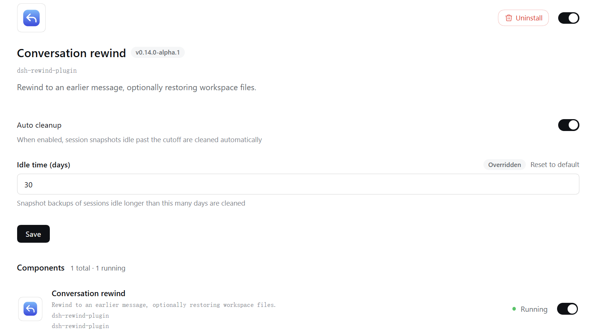

# dsh-rewind

Conversation rewind for DeepSeek Harness: **rewind the conversation to any earlier user message in one click, in the same window** — no new branch, no window switch, with optional workspace-file restore (full Claude Code `/rewind` semantics).

[](https://www.npmjs.com/package/dsh-rewind-plugin)
[](https://www.npmjs.com/package/dsh-rewind-plugin)
[](https://github.com/SiriLee/dsh-rewind/actions/workflows/ci.yml)

> English | [中文](README.md)

A deliberately focused plugin with one job: **rewind to any user message, no matter how far back, in place** — and conveniently **restore the files it changed** along the way.

- **Rewinding is time-travel** — the target message and everything after it (agent replies, tool calls) are withdrawn from the model context *and* the rendered transcript at once, with no new session and no window switch; the target's text is offered back in the composer so you can edit and re-send it — **truly seamless and convenient by design**.
- **Lightweight workspace backup** — Claude Code-aligned behavior: tracks files edited by the write-class tools, and external changes to **already-tracked** files are restorable too. Selective tracking, before-write backup, store only on change. One lightweight plugin gives you a **complete** agentic rewind capability.
- **Privacy-first** — the plugin never deletes or rewrites the session log (append-only) and never actually deletes any of your conversation; backups live in the plugin's own snapshot directory; restores draw only from those backups. Full security model: [SECURITY.md](SECURITY.md).
- **A complete test system** — unit, probe, and end-to-end host verification, covering compatibility probing, log replay, resume, cross-restart and other scenarios; maintained continuously as the harness evolves to ensure feature stability.

## Preview

Every user message carries a **↶ rewind** button in its action row. Clicking it opens a mode-selection popover — "**rewind conversation only**" or "**rewind conversation and code**", the latter showing the file-change list for confirmation first. You can also rewind conveniently via the **`/rewind` command** or a **keyboard shortcut**.

<table>
  <tr>
    <td align="center"><br><sub>Per-message ↶ rewind button</sub></td>
    <td align="center"><br><sub>Mode-selection popover</sub></td>
  </tr>
  <tr>
    <td align="center"><br><sub>"Conversation and code" impact list</sub></td>
    <td align="center"><br><sub>/rewind candidate picker</sub></td>
  </tr>
</table>

## Install

```sh
dsh plugin --profile web add dsh-rewind-plugin
```

> ⚠️ The npm name `dsh-rewind` belongs to another author's package — install with `dsh-rewind-plugin`.

## Usage

1. Find the user message you want to rewind to in the conversation, or type `/rewind` (or its alias `/undo`) to open the candidate picker.
2. **Select it.** A small popover offers the two modes ("conversation and code" is only shown when there are restorable changes after the target).
3. The rewind takes effect immediately: the conversation returns to how it looked at the target message, and the withdrawn message's text is filled back into the composer — edit and re-send.

**Keyboard**: both the candidate picker and the mode popover support ↑↓ to move, Enter to confirm, Esc to cancel/back.

<details>
<summary><b>Edge notes</b></summary>

- Rewinds can be repeated — with no limit on stage or count.
- A rewind itself **cannot be undone**, but the withdrawn content stays in the session log and can be recovered by manually editing it.
- **Interruptions rewind too** — a `steering` interruption message the model hasn't read yet is also a valid rewind target.
- **A rewind interrupts the running turn** — to execute the rewind safely.

</details>

## Snapshot management

Snapshots (the before-write backups) are stored under `<dsh home>/rewind-snapshots/`
(`~/.dsh/rewind-snapshots/` when `$DSH_HOME` is unset). For the **same session**,
the plugin deduplicates snapshots by content (an unchanged file is stored as a link)
and keeps the newest 100 anchor groups. **Deleting that directory manually** only
clears the file backups (chat rewinds are unaffected) and the plugin rebuilds them
automatically.

A **global auto-cleanup** (off by default) removes the snapshot directories of
long-inactive sessions, leaving the active session and chat log untouched. Configure
and review it in the **Settings &gt; Plugins &gt; Plugin configuration &gt; Snapshot
cleanup** panel (the auto-cleanup switch and the idle-day cutoff), or use the
`/snapshot-auto-cleanup` command to **view, configure, and run** it. See:
[Snapshot cleanup](docs/snapshot-auto-cleanup.md).



## Why it stands out

Compared with the common approaches, here is the trade-off this plugin makes on "rewind":

| Dimension | Common approach | This plugin |
| --- | --- | --- |
| Conversation rewind | Fork / branch a new conversation | **In-place rewind** — no new session, no window switch |
| File restore | No restore feature / git-managed or whole-tree snapshot | **Lightweight before-backups** — auto-captured before writes, one-click restore (aligned with Claude Code) |
| Dependencies | Often needs a Git repo or a full snapshot engine | **None** — no git required, works on any directory |
| Storage footprint | Whole-tree snapshots take space | **Lightweight** — only files touched by write tools are stored, persisted on disk |

## How it works

The whole design rests on two principles, simple but deliberate: **the conversation half "masks, never deletes", and the file half "backs up before the write, reconciles against the real disk before restoring."** It shares lineage with Claude Code's checkpointing — Claude Code's file history is also per-file records plus a re-scan of tracked files at every message, not a whole-tree snapshot. This plugin brings the same semantics to dsh, and makes them lighter and more robust.

### 1. Conversation rewind: a single "mask", not a delete

`append-only` is a hard rule: the session log only grows and is never rewritten — the foundation of auditability and privacy. A rewind never touches history; it makes a single move: append **one empty-content message marker** to the end of the log and use it to "mask out" everything after the target message, so the model and the UI see only the part before it.

- The marker is **empty** — it never enters the model context and never renders as conversation content; what you and the model see is exactly how the conversation looked at the target. True "in place".
- Because this is **masking, not deleting**, every withdrawn event stays in the log — auditable, traceable, and in principle manually recoverable.
- The marker is deeply **aware of dsh internals**: it reuses the **last-started turn** number (never "last turn + 1") and carries its own **ghost step frame**. So the harness's own log replay, `/compact`, and resume preflight all recognize it and never mistake it for a real message.

> **Design highlight**: the entire conversation rewind is **a single append**. It's deterministic, auditable, and — because the log was never broken — a "clean" time-travel. Minimal action, complete semantics. The compatibility subtleties with the harness (ghost step frame, reused turn number) are where this plugin is genuinely professional — each is pinned by a dedicated probe test.

### 2. File restore: lightweight checkpointing, "back up before the change"

The file half follows Claude Code's checkpoint semantics — **partial tracking + before-write backup, plus a re-scan of tracked files at each message**, not a whole-tree snapshot. This trade-off saves space, and it's actually more complete:

- **Before-write backup**: tracks only the write-class tools (`write`, `edit`, `str_replace_editor`) — backs up the original content before a write and records/tracks the files it touches; it never backs up the whole workspace, so it's lightweight.
- **External changes count too**: at every user-message boundary the plugin re-checks all tracked files — external changes such as a command run or a manual edit are recorded as well and restored by a later rewind. "Lightweight" but not "incomplete".
- **Unchanged-not-recorded, identical-content-as-link**: an entry is written only when something changed — at the message-boundary re-check, an unchanged file is never backed up (no record); at before-write time, when the new content matches the path's prior record, only a **link to it** (`ref`) is stored instead of a copy. Repeated writes cost almost nothing, and a link is materialized before its group is evicted — never left dangling.
- **Reconcile against the real disk before restoring**: restore takes each path's **earliest** record, then reads the live file and compares — **only files that actually differ are touched**: modified files are written back to the earliest backup, files created after the target are deleted, already-matching files are skipped. Repeated rewinds are therefore **idempotent with zero side effects** and never produce "ghost impact".
- **Safety boundary**: symlinks / hard links are skipped so one restore can't clobber another name of the same file; paths are sanitized so nothing ever escapes the backup root; a per-file failure never aborts the pass.

> **Design highlight**: this checkpoint's light footprint comes from **recording only what was actually touched and really changed** — before-write backup makes it restorable, unchanged-not-recorded and content-as-link drop the repetition; which files to touch is decided against the real disk at restore time.

### Design highlights

| Design | Why it matters |
| --- | --- |
| A single append is a whole rewind | Minimal action, maximal semantics; the log is never mutated |
| Mask, never delete | History is always auditable and in principle recoverable |
| Before-backup, grouped by turn, persisted on disk | Space-efficient, survives restarts, Claude Code-aligned |
| Identical content stored as a link (dedup) | Hundreds of repeated writes cost almost nothing; links are materialized before their group is evicted, never left dangling |
| Session-level auto-cleanup | Removes only long-inactive sessions' snapshots; the active session and the chat log are never touched |
| Reconcile against the real disk before restoring | Idempotent, zero side effects, no collateral damage |
| Ghost step frame + reused turn number | Deeply compatible with the host, pinned by probe tests |
| Crash safety (atomic writes + restore journal) | Continue or roll back cleanly after a crash |
| Pure-function planning + probed store | Fully unit-testable without a host; test-driven |

## What it deliberately does NOT do

This plugin deliberately stays lightweight and focused on one thing — "conversation rewind". The following are **out of its scope**:

- **Whole-tree / Git-level snapshots** — only write-class tool edits plus external changes to already-tracked files are backed up; files never touched by a tool are not restored. For whole-worktree snapshot rollback, use a dedicated snapshot tool (or your git).
- **Subagent edits** — not tracked (same as Claude Code): a subagent runs its own session, so its backups could never be restored by a rewind of the parent session.
- **Fork / branch rewind** — the harness already provides this ("branch in new chat"); no need to reinvent it.

## Compatibility

- Node.js `^22.19.0 || >=24.0.0`.
- Compatibility definition, verification method, and version alignment: see [docs/compat/audit.md](docs/compat/audit.md); supported DSH versions are declared by `package.json` `peerDependencies`.

> [!WARNING]
> This project and DeepSeek Harness are both in developer preview. Pin exact
> versions in reproducible environments and review the behavior notes above.

## Client contract

Third-party DOM plugins that need to know which transcript rows a rewind
withdrew should consume the stable, locale-independent helpers exported from
`dsh-rewind-plugin/client` — never parse
`outcome.text`. The `data-dsh-rewind-hidden` attribute marks withdrawn rows
(observational only). Details: [docs/contract/client-contract.md](docs/contract/client-contract.md).

## Known issues

1. **Exported logs are complete** — a rewind only removes messages from the model context and the view; the exported session log (`/export`) still contains **withdrawn messages**. This plugin cannot alter exports.
2. **Lightweight file rewind has a cost** — in specific cases not all changes can be rewound. Consistent with Claude Code. See: [File-rewind tracking boundary](docs/compat/tracking-boundary.md).
3. **Rewinds from `≤ v0.2.4`** — sessions rewound with these versions may **fail to load history** after more conversation. Install a v0.3.3-or-earlier release and use its bundled repair tool ([docs/compat/troubleshooting.md](docs/compat/troubleshooting.md)).
4. **Rewinds from `≤ v0.3.3`** — compaction (`/compact`) is unavailable for those sessions. Newer versions are compatible; for affected old sessions, start a new session.
5. **The turn-rail shows rewound turns** — the right-side rail added in DSH `v0.1.2` keeps ticks for withdrawn messages, and hovering shows the withdrawn text. Only a display difference; no functional impact.
6. **The system prompt is re-displayed after a rewind** — in DSH `v0.1.2`, rewinding and resending a message shows the "System prompt" component again, just like `/compact`. Only a display difference; no functional impact.

> [!NOTE]
> Browser diagnostics are available; see [Browser diagnostics](docs/compat/diagnostics.md).

## Security

This plugin only appends rewind-marker events to the session log; it never deletes or rewrites logged history. Workspace files are written only when you choose "conversation and code"; backups are stored under `<dsh home>/rewind-snapshots/`; restores draw only from those backups. It never touches your git repository, makes no network requests, and accesses no credentials. Delete `~/.dsh/rewind-snapshots/` to wipe file backups only (chat rewinds are unaffected); the plugin rebuilds automatically. For sessions you've left inactive for a long time, a global auto-cleanup (off by default) can remove their snapshot directory in whole, leaving the active session and the chat log untouched. Full security model: [SECURITY.md](SECURITY.md).

## Development

```sh
npm install            # devDeps from the npm registry
npm run check          # one-shot full gate: typecheck + test + build + verify:host + pack --dry-run
npm run typecheck      # tsc on all three surfaces (host + client + client-test)
npm test               # vitest: all unit and compatibility suites
npm run build          # esbuild: lib/index.js (host ESM) + lib/client.js (loader closure) + .d.ts
node scripts/verify-host.mjs   # end-to-end verification of the built artifact
```

`prepare` runs the full build, so git installs and `npm pack` / `npm publish` always produce a complete `lib/` and the `LICENSE`.

Maintainers: the module map and harness interface reference live in [docs/harness-reference.md](docs/harness-reference.md).

Contributing guide: [CONTRIBUTING.md](CONTRIBUTING.md).

## Release

Releases go out through GitHub Actions Trusted Publishing (OIDC, no stored `NPM_TOKEN`): push a `v<version>` tag and CI publishes with Sigstore provenance.

```sh
npm version patch && git push origin main --tags
```

One-time npm-side setup and the full workflow details: [docs/release/release.md](docs/release/release.md).

## License

[MIT](LICENSE)
