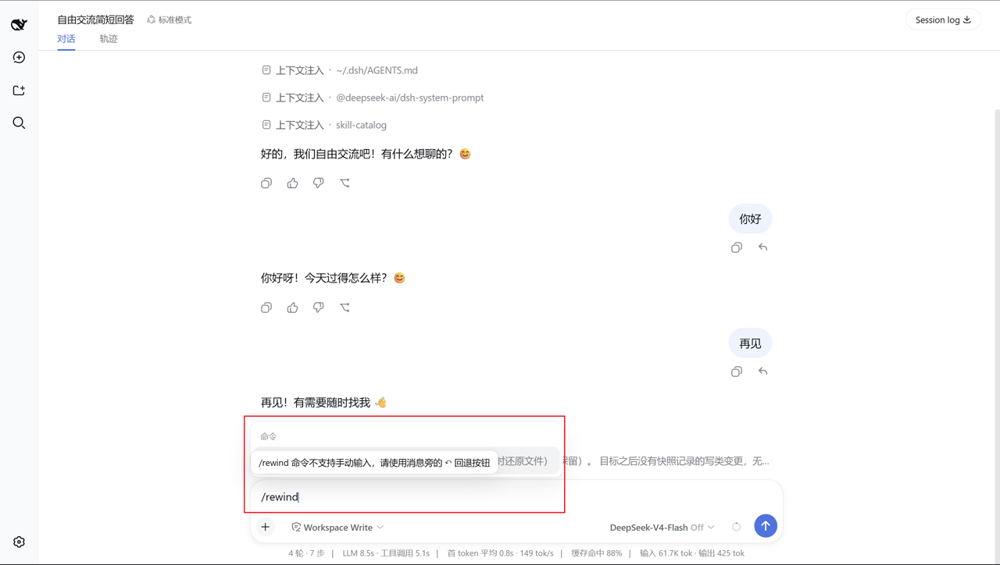

# dsh-rewind

In-place conversation rewind for [DeepSeek Harness](https://github.com/deepseek-ai/deepseek-harness): Claude Code's `/rewind` semantics inside the **same session window** — cut the model context back to an earlier user message, and optionally restore workspace files from disk-persisted before-backups.

[](https://www.npmjs.com/package/dsh-rewind-plugin)
[](https://github.com/SiriLee/dsh-rewind/blob/main/LICENSE)

> English | [中文](README.zh.md)

A deliberately focused plugin with one job: rewind to any earlier user message, in place.

| Mode | Conversation | Workspace files |
| --- | --- | --- |
| **Rewind conversation only** | Cut back to the target message | Untouched |
| **Rewind conversation and code** | Cut back to the target message | Restored to their state before it (modified files written back, later-created files deleted) |

Rewinding is time-travel: the target message and everything after it (agent replies, tool calls) are withdrawn from the model context *and* the rendered transcript — no new session, no window switch — and the target's text is offered back in the composer so you can edit and re-send it.

The plugin never rewrites the append-only session log and never touches your git repository.

## Preview

Each user message gains a compact **↶ rewind** action in its action row. Clicking it opens a mode-selection popover; "conversation and code" first shows the exact restore / delete list for confirmation (the option is hidden when there are no tracked changes — like Claude Code's code-restore visibility).

<table>
  <tr>
    <td align="center"><br><sub>Per-message ↶ rewind button</sub></td>
    <td align="center"><br><sub>Mode-selection popover</sub></td>
  </tr>
  <tr>
    <td align="center"><br><sub>"Conversation and code" impact list</sub></td>
    <td align="center"><br><sub>Manual /rewind guard hint</sub></td>
  </tr>
</table>

Manual `/rewind` input in the composer is intercepted — submitting shows a transient hint pointing at the ↶ button.

## Install

```sh
dsh plugin --profile web add dsh-rewind-plugin
```

Restart `dsh web` (`--profile web`) after installing.

> ⚠️ The npm name `dsh-rewind` belongs to another author's package — install with `dsh-rewind-plugin`.

From a local checkout or a pinned GitHub commit:

```sh
dsh plugin --profile web add /path/to/dsh-rewind              # local checkout
dsh plugin --profile web add github:SiriLee/dsh-rewind#<sha>  # pinned commit
```

A git install fails on first run: pnpm blocks git dependencies from running build scripts. Follow the CLI hint to add an `allowBuilds` key to the profile's `pnpm-workspace.yaml`, then retry — pnpm runs the plugin's `prepare` (full build) and installs it.

## Usage

1. **Hover** any user message you sent — a **↶ rewind** button appears in its action row.
2. **Click it.** The target is that message; a small popover offers the two modes ("conversation and code" is hidden when no tracked file changes exist after the target).
3. The rewind executes as an in-session command; a result message confirms, and the withdrawn message's text is filled back into the composer for editing and re-sending.

The ↶ button appears on user messages rendered in the **current session view** — switch to another session before rewinding it. A rewind can itself be rewound (its marker enters the log), but the file-restore action is not re-backed up.

## How it works

### 1. Conversation rewind (in-place)

The plugin appends an **empty-content marker** `assistant/message` into the session log whose `surfaceOp: { op: 'replace', start, end }` replaces every surface node after the target message with the marker:

- The marker carries `sourceEventSeqs` covering every shadowed node, and `Session.append`'s surface rules validate the cut (a contiguous range on the current surface).
- Because the marker is **empty**, the harness derives it to `null` — it never enters the model context and never renders as conversation content. Agent and user both see the conversation exactly as it was at the target.
- The marker's **turn number reuses the last started turn** (`markerTurnOf`), never `lastTurn + 1`: the harness numbers its next real turn exactly `last turn/start + 1`, so a `maxTurn + 1` marker would sit *before* that `turn/start` — the client conversation builder rejects the ordering (`…turn-tail… received an update before its start Match`), history load fails, and the whole conversation disappears from the UI (the real defect in ≤ 0.2.4, fixed in 0.2.5). Reusing an already-consumed turn makes the marker a harmless trailing update on the previous completed turn's tail — it can never collide with a future turn.
- The append-only log is **untouched** — every withdrawn event stays in the audit trail; only the model-visible surface is cut, so the next request derives its context from the target onward.

A running turn (LLM thinking / streaming) is force-stopped first (`cancel({ kind: 'user' })`) and the rewind waits for quiescence; if it can't stop, the rewind is aborted with an error.

### 2. Checkpoint file restore

The plugin tracks the write-class tools — `write`, `edit`, `str_replace_editor` (mutating commands `create` / `str_replace` / `insert`):

1. **Before-capture** at `tools/execute` (the around-dispatch stage): the target file is read; the resolved path + content are held in a pending map. This stage runs only after any pre-execute approval gate let the call through — an `ask` short-circuit (dsh-edit-approval) **cannot skip** the backup, and a denied call never records. If the read fails (e.g. a permission error), the change is simply not backed up — the plugin warns in the log but **does not block the write**.
2. **Disk commit** at `tools/post-execute`: the before-backup is written under the turn's anchor message seq (`~/.dsh/rewind-snapshots/<session>/<anchor seq>/<callId>.json`).
3. **Restore** (`/rewind @<seq> both`): every backup anchored at or after the target applies — modified files are written back to their **earliest** captured before-state, files created after the target are deleted, symbolic / hard links are skipped (they share an inode with another name; restoring through one would clobber both). Writes go through plain `node:fs`, independent of the fs service — under sandbox / remote backends, path resolution may be restricted.
4. A tool body that **throws** skips `tools/post-execute`; a `tools/result` safety net clears the pending capture so nothing leaks in memory.

Backups persist across host restarts, bounded to the newest 100 anchor groups per session.

## What it deliberately does NOT do

- **Whole-tree / git-first snapshots** — only write-class tool edits are backed up. `bash`, other tools, and external edits are not tracked and cannot be restored: the same limitation as Claude Code, which defers such rollbacks to the user's git.
- **Subagent edits** — not tracked (same as Claude Code): a subagent runs its own session, so its backups could never be restored by a rewind of the parent session.
- **Fork / branch rewind and `/compact`** — the harness already provides these ("branch in new chat", compact).
- **Keyboard shortcuts** (esc+esc rewind menu) — planned as a follow-up.

## Comparison with similar projects

[DeepSeek Harness](https://github.com/deepseek-ai/deepseek-harness) also has [Anionex/dsh-turn-rewind](https://github.com/Anionex/dsh-turn-rewind) — a rewind plugin with the same user-facing idea (a per-message action that rolls the conversation back and restores workspace files). The goals overlap, but the approach and positioning differ sharply:

| Dimension | dsh-rewind (this plugin) | Anionex dsh-turn-rewind |
| --- | --- | --- |
| Conversation rollback | **In-place, same session/window** — an empty marker `assistant/message` uses `surfaceOp: replace` to cut the model-visible surface back to the target; the append-only log is untouched | **Forks a new Session** — DSH logs are append-only, so "restart" creates a blank/forked session at the previous `turn/end`; the original session is always retained |
| Claude Code `/rewind` semantics | Faithful: time-travel cut, the withdrawn message is refilled into the composer, the code-restore option hides when no tracked changes exist | Different shape: restore-and-restart vs restore-files-only, plus a native **Branch** button for conversation-only branching |
| File-restore engine | **Lightweight before-backups** of write-class tools only (`write`/`edit`/`str_replace_editor`), captured at `tools/execute`, persisted to disk, restored via plain `node:fs` | **Change Ledger** — a durable, content-addressed restore-point engine with Git-worktree/HEAD/branch fences, expiring plans, an approval gate, auto rescue points, hash verification, rollback and crash reconciliation; supports Git worktrees only |
| Tracked-change scope | Only write-class tool edits (like Claude Code) — `bash` and external edits are not tracked | Any Git-managed file (tracked / untracked / links / modes), explicitly refusing sparse checkouts, submodules and ignored files |
| Subagent edits | Not tracked (Claude Code alignment) | Not tracked |
| Git control plane | Never touched | Never touched (but requires a Git worktree) |
| Public service API | No — a focused single-purpose plugin | Yes — exposes `ctx.changeLedger` for other plugins plus a `/turn-rewind` HTTP endpoint |
| Position | A thin, opinionated Claude-Code-style rewind for the dsh web UI | A reusable, defensive restore engine with a Web dialog on top |
| License | MIT | BSD-3-Clause |

**What makes this plugin distinct:** the *in-place, same-window time travel*. Because dsh-turn-rewind keeps the log immutable it must fork a new session; this plugin instead cuts the model-visible surface with an empty marker, so the original conversation continues in the same window and the audit log stays complete. That surface-cut is the non-trivial part (the marker turn must reuse the last started turn or history replay breaks — see [Known issues](#known-issues)), and it is precisely the piece dsh-turn-rewind sidesteps.

## Compatibility

- Node.js `^22.19.0 || >=24.0.0`.
- DeepSeek Harness web profile (`dsh --profile web`); peer `@deepseek-ai/*` packages are resolved by the harness at runtime.

> [!WARNING]
> This project and DeepSeek Harness are both in developer preview. Pin exact
> versions in reproducible environments and review the behavior notes above.

## Known issues

Rewinds created before `v0.2.5` could corrupt client replay when followed by more conversation (a marker turn collides with the next `turn/start`). The offline repair tool ships **inside the npm package** (`dsh-rewind-repair`). This only affects sessions you already had before upgrading — a fresh v0.2.7 install never hits it.

Full instructions: [docs/troubleshooting.md](docs/troubleshooting.md)

## Security

This plugin only appends rewind-marker events to the session log; it never deletes or rewrites logged history. File writes happen only when you choose "conversation and code" — before-backups and restores stay under `~/.dsh/rewind-snapshots/`. It never touches your git repository, makes no network requests, and accesses no credentials.

## Development

```sh
npm install            # devDeps from the npm registry
npm run typecheck      # tsc on both compilation surfaces (host + client)
npm test               # vitest: rewind / snapshot / hidden / session-cwd / integration (46 cases)
npm run build          # esbuild: lib/index.js (host ESM) + lib/client.js (loader closure) + .d.ts
node scripts/verify-host.mjs   # boot the BUILT host artifact end-to-end (18 checks)
```

`prepare` runs the full build, so git installs and `npm pack` / `npm publish` always produce a complete `lib/` and the `LICENSE`.

Maintainers: the module map and harness interface reference live in [docs/harness-reference.md](docs/harness-reference.md); publishing steps in [docs/release.md](docs/release.md).

## Release

Releases go out through GitHub Actions Trusted Publishing (OIDC, no stored `NPM_TOKEN`): push a `v<version>` tag and CI publishes with Sigstore provenance.

```sh
npm version patch && git push origin main --tags
```

One-time npm-side setup and the full workflow details: [docs/release.md](docs/release.md).

## License

[MIT](LICENSE)
